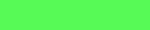
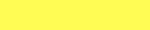

	                   _  _                       _   
	                  (_)(_)                     | |  
	  __ _  ___   ___  _  _  ______   __ _  _ __ | |_
	 / _` |/ __| / __|| || ||______| / _` || '__|| __|
	| (_| |\__ \| (__ | || |        | (_| || |   | |_
	 \__,_||___/ \___||_||_|         \__,_||_|    \__|

ascii-art.js
============

Images, fonts, tables, ansi styles and compositing in Node.js & the browser. 100% JS.

In the beginning there was [colors.js](https://github.com/Marak/colors.js) but in the fine tradition of vendors calling out a problem they have the solution to, [chalk](https://github.com/yeoman/yo/issues/68) was introduced. In that same vein, I offer `ascii-art` as an update, expansion and generalization of [MooAsciiArt](http://mootools.net/forge/p/mooasciiart) and at the same time it can replace your existing ansi colors library.

It features support for [Images](docs/Images.md), [Styles](docs/Styles.md), [Tables](docs/Tables.md) and [Figlet Fonts](docs/Figlet.md) as well as handling multi-line joining automatically.

Why would I use this instead of X?
----------------------------------
- **zero dependencies** - while the CL utility and test have dependencies, we will never call out to a module for what is supposed to be this lib's core competancy.
- **color profiles** support - other libraries assume you are running x11
- **no prototype manipulation** - No `String.prototype` usage. No `__proto__` usage. No BS.
- handles the ugly [intersection of **multiline text and ansi codes**](docs/Multiline.md) for you.
- runs in the **browser and Node.js** (CommonJS, AMD, globals or webpack)
- **JS + Canvas** Ascii image generation utilities in node don't actually touch any pixels, but usually call out to a binary, we do 100% of our transform in JS, which allows us plug into averaging, distance and other logic dynamically, in powerful ways.
- It **works like a package manager** for figlet fonts.
- The **other libraries** out there **do too little**, focus on logging above other domains and often unaware of ANSI controls(for example: style text, then put it in a table).
- **Supports your existing API** We allow you to use the colors.js/chalk API *or* our own (where we reserve chaining for utility rather than code aesthetics).
- **Loads nothing that isn't used** (Images, Fonts, Tables, Logic, etc.)

Installation
------------

	npm install ascii-art

If you'd like to use the command-line tool make sure to use `-g`

If you want to use `.image()` or `.Image` you must install [`canvas`](https://www.npmjs.com/package/canvas) and if you want to run the chalk tests... you'll need to to install `require-uncached` as well.

Styles
------

Add ANSI styles to a string and return the result.

| In your code                                    |         In the [Terminal](docs/Terminal.md)                           |
|-------------------------------------------------|---------------------------------------------------|
| `.style(text, style[, close]) > String`          | `ascii-art text -s green "some text"`             |

Styles are: *italic*, **bold**, underline, |framed|, |encircled|, overline, blink and &nbsp;inverse&nbsp;. And available colors are:

| **Color Table**  | `color`       | bright_`color`  | `color`_bg| bright_`color`_bg|
| -----------------|---------------|-----------------|-----------|------------------|
| black   |||||
| red     |||||
| green   ||| ||
| yellow  |||||
| blue    ||| ||
| cyan    ||| ||
| magenta |||||
| white   |||||

For example: if I wanted underlined blue text on a white background, my style would be `underlined+blue+white_bg`. Check out the detailed [style docs](docs/Styles.md) for more information.

Fonts
-----

Render a string using a figlet font and add that to the buffer. There is a batch version of this function which does not chain and takes an array( `.strings()`).

| In your code                                    |         In the [Terminal](docs/Terminal.md)                           |
|-------------------------------------------------|---------------------------------------------------|
| `.font(text, font[, style][, callback])`    | `ascii-art text -F  "Demo!"`             |

Outputs

	______                          _
	|  _  \                        | |
	| | | |  ___  _ __ ___    ___  | |
	| | | | / _ \| '_ ` _ \  / _ \ | |
	| |/ / |  __/| | | | | || (_) ||_|
	|___/   \___||_| |_| |_| \___/ (_)

Check out the [documentation](docs/Figlet.md) for more examples!

Images
------

Create an image from the passed image and append that to the buffer

| In your code                                    |         In the [Terminal](docs/Terminal.md)                           |
|-------------------------------------------------|---------------------------------------------------|
| `.image(options[, callback])`                   | `ascii-art image path/to/my/file.jpg`             |

Paired with a font call it looks like:

Check out the [documentation](docs/Images.md) for more examples!

Tables
------

Generate a table from the passed data, with support for many styles and append that to the buffer

| In your code                                    |         In the Terminal                           |
|-------------------------------------------------|---------------------------------------------------|
| `.table(options[, callback])`                   | N/A             |

Check out the [documentation](docs/Tables.md) for more examples!

Artwork
-------

fetch a graphic from a remote source and append it to the current buffer.

| In your code                                    |         In the [Terminal](docs/Terminal.md)                           |
|-------------------------------------------------|---------------------------------------------------|
| `.artwork(options[, callback])`                 | ascii-art art [source][/path]            |

Often I use this in conjunction with an image backdrop, for example to superimpose bones on the earth:

Compositing
-----------

We also support combining all these nifty elements you've made into a single composition, via a few functions available on the chains (`.lines()`, `.overlay()` and `.join()`). Maybe I've got A BBS wall I want to have some dynamic info on.. I could make that with

Check out the [documentation](docs/Compositing.md) for detailed examples!

256 color support
-----------------

**(Experimental!)** First ensure your terminal supports 256 colors (OS X users, [look here](https://gist.github.com/shawnbot/3277580)), then set `.colors` to `256` this will enable 256 color support across all generated assets.

Compatibility
-------------
If you're a [chalk](https://www.npmjs.com/package/chalk) user, just use `var chalk = require('ascii-art/kaolin');` in place of your existing `chalk` references (Much of color.js, too... since chalk is a subset of colors.js). No migration needed, keep using the wacky syntax you are used to(In this mode, refer to their docs, not mine).

Users of [ascii-table](https://www.npmjs.com/package/ascii-table) will also note that interface is supported via `require('ascii-art').Table`, though our solution is ansi-aware, lazy rendering and better at sizing columns.

I may support the other [colors](https://www.npmjs.com/package/colors) stuff (extras & themes) eventually, but it's currently a low priority.

Roadmap
-------

####Goals
- Better Docs
- Color handling/256 color support
- value reversal (light vs dark)
- HTML output
- [ANSI art](https://en.wikipedia.org/wiki/ANSI_art) support
- [PETSCII art](https://en.wikipedia.org/wiki/PETSCII) support
- More stuff!! (averagers, color profiles)
- true color (hex) support
- 2 colors per char (possibly zalgo-painting?)

####Non Goals

- realtime: videos, curses, etc.:
- logging integration

Testing
-------
In the root directory run:

	npm run test

which runs the test suite directly. In order to test it in Chrome try:

	npm run browser-test

In order to run the chalk test, use:

	npm run chalk-test

Please make sure to run the tests before submitting a patch and report any rough edges. Thanks!

Enjoy,

-Abbey Hawk Sparrow
